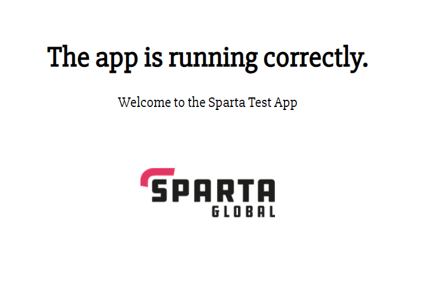

# Multi Machine Vagrant
This repository combines the VM's made in the [mongo db repo](https://github.com/samturton2/DEV_ENV-mongo_db_task) and the [sample node app repo](https://github.com/samturton2/DEV_ENV-node_sample_app). 

## Summary
The sample application has the ability to connect to a database. We need to provision our development environment with a vm for the database and one for the database.

Vagrant is capable of running two or more virtual machines at once with different configurations.

# Instructions
These instructions will take you through how to setup and run this virtual environment. Please complete the prequisites first and complete the tasks in order.

## Prerequisites
- Click on the below repo, and follow the steps to downloading Ruby, then vagrant, then virtual box. Ignoring step 4 for now.

  - https://github.com/khanmaster/vb_vagrant_installtion
- Once all 3 programmes are installed clone this repo on your device.

  - copy the url link of this repo
  - Open your bash terminal as admin
  - In the directory you want the repo follow these commands
  - git init
  - git clone <pasted link>

## Main Commands
- First check if there is a .vagrant/ file in the repo using
```bash
ls -a
```
- Run command to initiate vagrant in the repo if no .vagrant file is found
```bash
vagrant init
```

- Run this command for a list of your installed plugins
```bash
vagrant plugin list
```

- If it shows `vagrant-hostsupdater` you can move on
- If not: install the plugin using this command
```bash
vagrant plugin install vagrant-hostsupdater
```
- For more information on this plug in view https://github.com/agiledivider/vagrant-hostsupdater or scroll to the extra commands section of this documentation.

- Run this command to start runnning the Virtual Machine
```bash
vagrant up
```

- Run these commands to enter the running app and db VM's respectivley
```bash
 vagrant ssh app
 vagrant ssh db
```

- If the app is ready to run, you can go to the port 3000 for the home of the app. Type into the url `http://192.168.10.100:3000`



#### Behind the scenes
- Vagrant up should run the the provision.sh files in both the db and the app folders in the environment folder

##### app provision.sh
- In this file we can see all shell commands to install the packages necessary to running this app in the app VM. 
- Before starting the app we use our bash commands to declare the environment variable `DB_HOST` to direct the app to the db ip address and link the two
- If you open the vagrant file in the main directory, you should see the `config.vm.provision` command (line 17)  telling the programme to run the provision installation commands once the virtual environment is up and running.
- The final paragraph in the provision file are the commands to run the app, as you open the VM. Can # it out and enter manually if you dont want the app to run instantly.
- line 30 - 35 is the process of syncing a reverse proxy file so that the app can run when the alias is typed straight into the url

##### db provision.sh
- In this file we can see all shell commands to install the packages necessary
for running a MongoDB in the db virtual machine
- If you open the vagrant file in the main directory, you should see the config.vm.provision command (line 17) telling the programme to run the provision installation commands once the virtual environment is up and running.
- In the vagrant file, notice the line which syncs a config folder to the VM. This folder has a copy of the mongo config file with the bing IP address changed manually to 0.0.0.0. In the provision file (before the mongodb is started), it commands the vm to copy and replace the config file with my manually edited one, so the IP address is changed accordingly. The perpose of this is so the app can read the db from any ip address.

## Testing
- Open a new terminal whilst the virtual environment is still running.
- To install gems from the gemfile run
```bash
bundle install
```
- Install the gem bundler
```bash
gem install bundler
```
- `cd` into the directory of the `Rakefile` which should be in the `tests` folder. e.g  `cd ./tests`

- Run this command to install the tests
```bash
bundler
```

- Run these commands to test the environments have all the packages needed

##### app virtual environment
```bash
rake spec:app
```
- This shoud return at most 4 failures, as long as these failures are the `--version` tests. This is due to the testing programe testing for out of date versions.

##### db virtual environment
```bash
rake spec:db
```
- All the tests should pass if mongodb is running in the correct place

## Extra commands
- To exit the running environment
```bash
exit
```

- To destroy the Virtual Machine once exited. (`vagrant up` to start running one again)
```bash
vagrant destroy
```

- To suspend the Virtual Machine
```bash
vagrant suspend
```

- To resume the VM once suspended 
```bash
vagrant resume
```

- To check the status of any `<package>` you should have in your VM. Enter this command in your VM terminal
```bash
sudo systemctl status <package>
```

- If for any reasons the `provision.sh` file commands havent ran and the relevant packages arent installed in the VM, copy the commands from the `provision.sh` file and manually paste them in the VM, and run the testing again.

- If Type Error with the `vagrant-hostsupdater`, still finding a fix, but for now can # out the `config.vm.hostname = "www.` line in the Vagrantfile. Can then enter the app by typing the ip address in the url.
